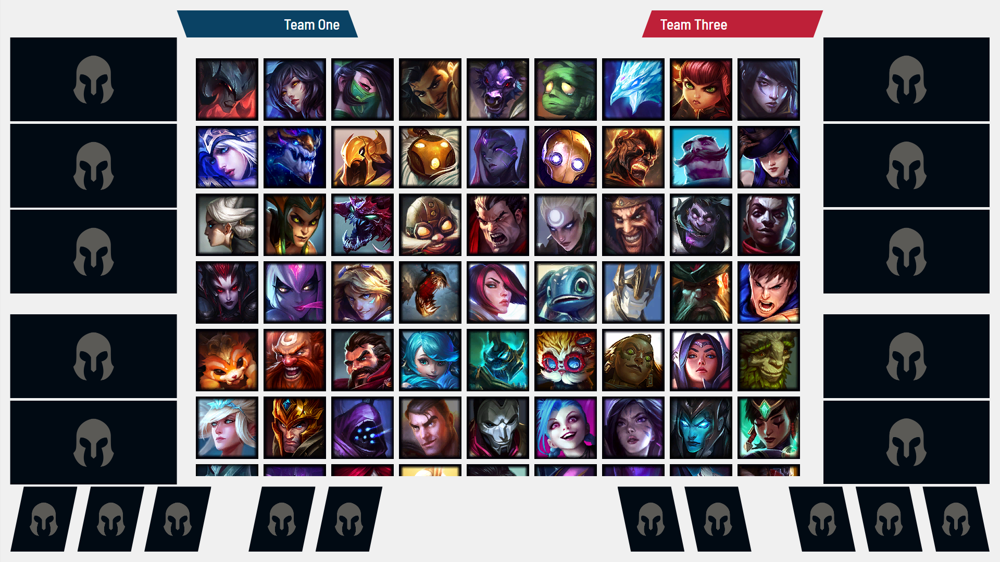

Copy paste the following code into the CSS field in your browser source on OBS or VMIX. This contains the CSS fields necessary to:
* Remove all buttons, role icon, search bar 
* Removes the drop shadow around the champion icon boxes 
* Changes the background color to a shadw of white
* Changes the font of the team names at the top

You can change the background color by changing the `background-color` property in `.roomContainer`. If you uncomment the `background-image` property and link it to an image hosted online, you can also add a background image. 

To add a different font, if you're changing to a font that *isn't* installed by default on machines, for example in my case Barlow Semicondensed, you need to define the font in @font-face first, and link to a download of the font via url. I'm linking to a font hosted on Google Fonts for this reason. 



```
body { 
	background-color: rgba(0, 0, 0, 0); 
	margin: 0px auto; 
	overflow: hidden; 
	font-family: 'Barlow Semi Condensed'; /*selecting font for team name txt*/
}

.roomContainer .champSquareWide { 
	filter: none; 
	box-shadow: none; 
}

.roomContainer .roomTeamName { 
	font-size:25px;
}

.burgerButton {
	opacity:0%;
}

.champsFilters {
	opacity 0%;
	display:none;
}

.roomContainer {
	background-color:#f0f0f0;
	/*background-image: url("https://cdn.discordapp.com/attachments/");*/
}

.roomLock {
	display:none;
}

/* vietnamese */
@font-face {
  font-family: 'Barlow Semi Condensed';
  font-style: normal;
  font-weight: 500;
  font-display: swap;
  src: url(https://fonts.gstatic.com/s/barlowsemicondensed/v14/wlpigxjLBV1hqnzfr-F8sEYMB0Yybp0mudRfi6m_CGslu50.woff2) format('woff2');
  unicode-range: U+0102-0103, U+0110-0111, U+0128-0129, U+0168-0169, U+01A0-01A1, U+01AF-01B0, U+1EA0-1EF9, U+20AB;
}
/* latin-ext */
@font-face {
  font-family: 'Barlow Semi Condensed';
  font-style: normal;
  font-weight: 500;
  font-display: swap;
  src: url(https://fonts.gstatic.com/s/barlowsemicondensed/v14/wlpigxjLBV1hqnzfr-F8sEYMB0Yybp0mudRfi6m_CWslu50.woff2) format('woff2');
  unicode-range: U+0100-024F, U+0259, U+1E00-1EFF, U+2020, U+20A0-20AB, U+20AD-20CF, U+2113, U+2C60-2C7F, U+A720-A7FF;
}
/* latin */
@font-face {
  font-family: 'Barlow Semi Condensed';
  font-style: normal;
  font-weight: 500;
  font-display: swap;
  src: url(https://fonts.gstatic.com/s/barlowsemicondensed/v14/wlpigxjLBV1hqnzfr-F8sEYMB0Yybp0mudRfi6m_B2sl.woff2) format('woff2');
  unicode-range: U+0000-00FF, U+0131, U+0152-0153, U+02BB-02BC, U+02C6, U+02DA, U+02DC, U+2000-206F, U+2074, U+20AC, U+2122, U+2191, U+2193, U+2212, U+2215, U+FEFF, U+FFFD;
}
```